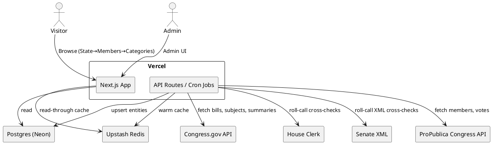

# SPEC-1-Congressional Clarity

## Background

You’re building a public website that lets any voter quickly see **how their U.S. Congressional representatives vote on issues**. The current repo and Vercel deployment show a state picker that routes to state-specific pages, suggesting an eventual drill‑down to districts and members. The intended value is to replace scattered roll‑call records with a clear, issue‑centric view (e.g., "environment," "immigration," "budget"), paired with plain‑English explanations and links to authoritative sources. Core ambitions implied by the project:

- Aggregate **official roll‑call votes** from House and Senate into one consistent data model.
- Map each vote to **issues/topics** so non‑experts can filter by what they care about.
- Let users **enter a location** (state/ZIP) to retrieve their members and see recent votes, stances, and trends.
- Present **neutral, source‑linked facts** with minimal jargon.

**Assumptions (to validate):**
- MVP scope: votes from the **118th–119th Congress** onward, with per‑member vote history and basic issue tagging.
- Data sources: ProPublica Congress API for members/votes; House Clerk & Senate roll‑call pages for cross‑checks; Congress.gov API (beta) for House vote details; later enrichment with bill summaries/subjects.
- Tech stack direction: Next.js app (as in repo) with server routes for data ingestion + a small persistence layer for caching and issue tagging.

---

## Requirements

**MoSCoW Prioritization (MVP = Must + Should)**

**Must Have**
- US-wide coverage for current Congress: all House & Senate members, their roll-call votes, and basic member metadata (name, party, state, district, chamber).
- Issue taxonomy = **Official bill subjects** (from Congress.gov/ProPublica) **+ curated mainstream categories** (e.g., "Gun Control", "Abortion", "Immigration", "Climate Change", "Budget/Spending").
- Deterministic mapping of each vote to one or more issues using: bill subjects, keywords in bill titles/summaries, and a small, reviewable ruleset.
- Users browse by **state → chamber → member** (no address lookup).
- For each member: a recent votes feed, filterable by issues, with clear **position labels** (Yea/Nay/Present/Not Voting) and links to official roll-call pages.
- Neutral presentation with **source links** and a concise, plain-English explainer for each vote/bill.
- Fast page loads via server-side rendering/ISR and **API caching**; graceful handling of API rate limits.
- Accessibility (WCAG AA) and **mobile-first** UI.

**Should Have**
- Basic **trend indicators** per member and per issue (e.g., last 30/90 days stance distribution; party-line %).
- Search across bills/issues/members.
- **Tagging Admin UI** to manage custom issue categories and mapping rules.
- Simple **data quality dashboard** (missing votes, mapping confidence, last sync times).
- SEO-friendly routes and metadata (member, bill, issue pages).

**Could Have**
- Email updates for new votes on followed issues/members.
- Compare two members side-by-side on a chosen issue.
- Explanatory glossaries ("What is a cloture vote?", etc.).

**Won’t Have (for MVP)**
- Historical backfill prior to the 115th Congress.
- Real-time floor alerts; detailed whip counts.
- Opinionated scorecards or endorsements.


## Method

### Overall Architecture

A **Next.js** (app router) site on Vercel with:
- **Data ingestion jobs (serverless cron)** to fetch members, bills, and roll‑call votes from **Congress.gov API** and **govinfo/Clerk/Senate official feeds**, with cross‑checks to **House Clerk** and **Senate XML** where needed. Results are stored in **Postgres** (Neon/Supabase). **Upstash Redis** caches hot queries. 
- **SSR/ISR routes** for state → chamber → member, and per‑issue filtered views. 
- **Admin UI** (protected) to curate custom subject categories and review mapping rules.



### Data Model (ERD excerpt)

```plantuml
@startuml
entity Member { id: uuid PK
bioguide_id: text
chamber: enum(House,Senate)
state: char(2)
district: int?
first_name,last_name
party: char(1)
start_service: date
end_service: date? }
entity Bill { id: uuid PK
congress: int
chamber: enum
bill_type: text (e.g., H.R., S.)
bill_number: int
slug: text unique
short_title: text
summary: text
congress_gov_url: text
introduced_on: date }
entity Vote { id: uuid PK
roll_call: int
congress: int
chamber: enum
date: date
question: text
result: text
source_urls: jsonb
bill_id: uuid FK }
entity MemberVote { vote_id: uuid FK
member_id: uuid FK
position: enum(Yea,Nay,Present,NotVoting)
PRIMARY KEY(vote_id, member_id) }
entity Issue { id: uuid PK
key: text unique
label: text
type: enum(official,custom) }
entity BillIssue { bill_id: uuid FK
issue_id: uuid FK
confidence: numeric(3,2)
method: text
PRIMARY KEY(bill_id, issue_id) }
entity Rule { id: uuid PK
issue_id: uuid FK
pattern: text (regex/keyword)
field: enum(title,summary)
score: int
enabled: bool }
Member ||--o{ MemberVote
Vote ||--o{ MemberVote
Bill ||--o{ Vote
Bill ||--o{ BillIssue
Issue ||--o{ BillIssue
Issue ||--o{ Rule
@enduml
```

### Issue Taxonomy Strategy
1) **Official subjects**: Pull **Policy Area** + **Legislative Subject Terms** from Congress.gov for each bill; attach to `Issue(type=official)`. 
2) **Custom mainstream categories** (e.g., Gun Control, Abortion, Immigration, Climate Change, Budget/Spending, Healthcare, Taxes, Voting Rights, Education, National Security): store in `Issue(type=custom)`.
3) **Mapping algorithm** (deterministic, explainable):
   - Seed `BillIssue` from **official subjects** (confidence 0.9).
   - Apply **rules**: keyword/regex on `title` and `summary` (e.g., "assault weapon", "Roe v. Wade", "DACA"). Each matching rule adds score; convert to confidence 0–1.
   - Manual overrides allowed in Admin UI.

### Ingestion & Sync
- **Members**: nightly sync of active & historical members; capture terms to compute "since start of career" window. Use **Biographical Directory (BioGuide IDs)** as primary identifiers and seed core metadata from **congress-legislators** bulk data. 
- **Bills & Summaries**: for all bills tied to a synced vote, fetch from Congress.gov; persist `summary`, `subjects`, canonical URLs. 
- **Votes**: pull roll‑call lists per Congress/chamber; store `Vote` + `MemberVote`. For QA, compare counts with **House Clerk** and **Senate XML** endpoints. 
- **Scheduling**: Vercel **Cron Jobs** trigger incremental syncs (e.g., every 10 minutes during sessions; nightly backfills). 
- **Caching**: Upstash Redis for list pages (state/member/issue) and API responses; short TTL (5–15 min) + cache tags for revalidation. 

### Navigation & Pages (MVP)
- `/states` → list all states.
- `/states/{state}/senators` and `/states/{state}/representatives`.
- Member page `/members/{bioguide}` with tabs: **Overview**, **Issues**, **Votes**.
- Issue filter: clicking a **custom or official** category filters bill list for that member; each row shows *bill title*, *summary*, *link*, and *this member’s position*.

### Query Patterns
- **Member page (issues view)**: `SELECT b.short_title, b.summary, b.congress_gov_url, mv.position FROM Bill b JOIN Vote v ON v.bill_id=b.id JOIN MemberVote mv ON mv.vote_id=v.id WHERE mv.member_id=$1 AND EXISTS (SELECT 1 FROM BillIssue bi JOIN Issue i ON i.id=bi.issue_id WHERE bi.bill_id=b.id AND i.key = $2) ORDER BY v.date DESC;`
- **State → chamber lists**: cached queries that join Members by state/chamber and current term.

### Performance & Reliability
- Use **ISR** for state/chamber pages; **SSR** for member pages with cache.
- Backfills are chunked by Congress (e.g., 118th→) to respect rate limits; failed pages retried with exponential backoff.
- Observability: log cron runs, row counts, and diffs; surface in Admin dashboard.

### Content & Neutrality
- Show official bill/roll‑call links; display **Congress.gov**, **govinfo**, **Clerk/Senate** identifiers for traceability. 
- Short, non‑opinionated summaries (prefer Congress.gov `summary`). 

## Implementation

### 0) Tech Stack
- **Frontend**: Next.js (App Router), TypeScript, Tailwind, Vercel.
- **DB**: Postgres (Neon/Supabase). **Redis** (Upstash) for caching.
- **Background jobs**: Vercel Cron → route handlers (`/api/cron/*`).

### 1) Data Sources (government-first)
- **Congress.gov API**: bills, subjects, policy areas, House roll-call votes (beta, 118th →)
- **House Clerk**: roll-call vote pages & per-roll downloads
- **U.S. Senate**: roll-call vote lists + per-vote XML
- **GovInfo bulk**: bill text & bill status XML (for older sessions and summaries)
- **Biographical Directory** + **congress-legislators** for member metadata + IDs

### 2) Database DDL (Postgres)
```sql
create type chamber as enum ('House','Senate');
create type vote_pos as enum ('Yea','Nay','Present','NotVoting');
create type issue_type as enum ('official','custom');

create table member (
  id uuid primary key default gen_random_uuid(),
  bioguide_id text unique not null,
  govtrack_id int,
  first_name text, last_name text, party char(1),
  chamber chamber not null,
  state char(2) not null,
  district int,
  start_service date, end_service date
);

create table bill (
  id uuid primary key default gen_random_uuid(),
  congress int not null,
  chamber chamber not null,
  bill_type text not null,
  bill_number int not null,
  slug text unique not null,
  short_title text,
  summary text,
  congress_gov_url text,
  introduced_on date
);

create table vote (
  id uuid primary key default gen_random_uuid(),
  roll_call int not null,
  congress int not null,
  chamber chamber not null,
  date date,
  question text,
  result text,
  source_urls jsonb,
  bill_id uuid references bill(id)
);

create table member_vote (
  vote_id uuid references vote(id),
  member_id uuid references member(id),
  position vote_pos not null,
  primary key (vote_id, member_id)
);

create table issue (
  id uuid primary key default gen_random_uuid(),
  key text unique not null,
  label text not null,
  type issue_type not null
);

create table bill_issue (
  bill_id uuid references bill(id),
  issue_id uuid references issue(id),
  confidence numeric(3,2) default 0.90,
  method text,
  primary key (bill_id, issue_id)
);

create table rule (
  id uuid primary key default gen_random_uuid(),
  issue_id uuid references issue(id),
  pattern text not null,
  field text check (field in ('title','summary')),
  score int default 1,
  enabled boolean default true
);
```

### 3) Ingestion Plan (serverless cron)
- **Members (nightly)**: pull `congress-legislators` release → upsert `member` rows using `bioguide`; add chamber/state/district for current terms.
- **House votes (every 10 min during session)**: prefer Congress.gov House roll calls (118th→); fill gaps with Clerk per-roll downloads.
- **Senate votes (every 10 min during session)**: parse roll-call list → per-vote XML → map to `bioguide`/`lis_id` crosswalk.
- **Bills & Subjects (hourly)**: for each vote-linked bill, fetch title/summary/subjects/policyArea + canonical URL; backfill with GovInfo bill status XML if missing.

### 4) Issue Mapping (deterministic)
- Seed `issue` with official policy areas/subjects (type=official).
- Seed custom categories (type=custom) listed below.
- Create `rule` rows with keyword/regex and scores. Batch job computes `bill_issue` via title/summary matches and official subjects. Manual overrides in Admin UI.

#### 4.a Custom Categories (initial)
- **Gun Control** (`gun-control`) – keywords: assault weapon, background check, red flag, concealed carry, Brady, NICS.
- **Abortion** (`abortion`) – abortion, Roe v. Wade, Dobbs, Hyde Amendment, Planned Parenthood.
- **Immigration** (`immigration`) – DACA, asylum, border wall, E-Verify, visa, ICE.
- **Climate Change** (`climate`) – greenhouse gas, carbon, cap-and-trade, emissions, climate.
- **Budget/Spending** (`budget`) – appropriation, continuing resolution, CR, debt limit, budget reconciliation.
- **Healthcare** (`healthcare`) – Medicare, Medicaid, ACA, Obamacare, CHIP, drug pricing.
- **Taxes** (`taxes`) – tax credit, tax cut, IRS, capital gains, corporate tax.
- **Voting Rights** (`voting-rights`) – voter ID, Voting Rights Act, gerrymander, election security.
- **Education** (`education`) – Title I, student loan, Pell, school choice, ESSA.
- **National Security** (`national-security`) – NDAA, FISA, surveillance, defense authorization.
- **LGBTQ+ Rights** (`lgbtq`) – same-sex marriage, Obergefell, gender identity, transgender.
- **Criminal Justice** (`criminal-justice`) – sentencing, policing, qualified immunity, prison.
- **Technology/Privacy** (`tech-privacy`) – data privacy, Section 230, antitrust, AI, TikTok.
- **Foreign Policy** (`foreign-policy`) – sanctions, NATO, AUMF, war powers.

#### 4.b Rule Seeding (examples)
```sql
-- Insert issues
insert into issue(key,label,type) values
('gun-control','Gun Control','custom'),
('abortion','Abortion','custom'),
('immigration','Immigration','custom'),
('climate','Climate Change','custom'),
('budget','Budget/Spending','custom'),
('healthcare','Healthcare','custom'),
('taxes','Taxes','custom'),
('voting-rights','Voting Rights','custom'),
('education','Education','custom'),
('national-security','National Security','custom'),
('lgbtq','LGBTQ+ Rights','custom'),
('criminal-justice','Criminal Justice','custom'),
('tech-privacy','Technology & Privacy','custom'),
('foreign-policy','Foreign Policy','custom')
on conflict do nothing;

-- Example rules (title and summary fields), using case-insensitive regex (~*) with POSIX classes
insert into rule(issue_id,pattern,field,score)
select i.id, '(?i)assault[[:space:]]+weapon|background[[:space:]]+check|NICS|red[[:space:]]+flag', 'title', 2 from issue i where i.key='gun-control'
union all
select i.id, '(?i)Roe[[:space:]]+v\.?[[:space:]]+Wade|Hyde[[:space:]]+Amendment|abortion|Dobbs', 'summary', 2 from issue i where i.key='abortion'
union all
select i.id, '(?i)DACA|asylum|E-?Verify|border[[:space:]]+wall|visa|ICE', 'summary', 2 from issue i where i.key='immigration'
union all
select i.id, '(?i)greenhouse[[:space:]]+gas|carbon|cap-?and-?trade|emissions|climate', 'summary', 2 from issue i where i.key='climate'
union all
select i.id, '(?i)appropriation|continuing[[:space:]]+resolution|CR|debt[[:space:]]+limit|reconciliation', 'summary', 2 from issue i where i.key='budget';

-- Batch mapping (run hourly)
insert into bill_issue (bill_id, issue_id, confidence, method)
select b.id, i.id,
  least(0.95, 0.60 + 0.05 * coalesce(m.matches,0)),
  'official+rules'
from bill b
join (
  select bi.bill_id, count(*) as matches, min(i.id) as issue_id
  from (
    select b.id as bill_id, i.id
    from bill b
    join issue i on i.type='official' -- from Congress.gov subjects
  ) bi
  group by bi.bill_id
) o on o.bill_id=b.id
join issue i on i.id=o.issue_id
on conflict do nothing;
```

### 5) UI/Routes
- `/states` → list all states.
- `/states/{state}/senators` and `/states/{state}/representatives` → member lists.
- `/members/{bioguide}` → Overview | Issues | Votes.
- On member Issues tab: filter by **official** or **custom** category; list bills (title, summary, link) + this member’s vote.

### 6) Caching & ISR
- State/chamber pages: **ISR** (revalidate 5–15 min); member pages: SSR + Redis read‑through cache (keyed by `bioguide` + filter).

### 7) Observability & QA
- Store source URLs in `vote.source_urls`.
- Counters per cron run: votes parsed, member_votes inserted, missing bill links.
- Data quality page: roll-call totals vs Clerk/Senate counts by day.

### 8) Security & Neutrality
- No auth for public pages; Admin UI behind SSO (Vercel/Clerk/Auth0).
- Strict "source first" links to official sites.

### 9) Deliverables (MVP)
- Deployed Next.js app with routes above.
- Postgres schema + migrations.
- Cron jobs for House & Senate votes, bills, and subjects.
- Admin UI for custom categories/rules.
- Documentation on mapping logic and data lineage.

### 10) Nice-to-haves Post-MVP
- Compare two members on a chosen category.
- Trends charts per member/category.
- Simple newsletter for followed categories.

## Milestones

**M1 – Data Backbone (1–2 weeks)**
- Provision Postgres/Redis; run migrations.
- Implement ingestion for Senate & House roll-calls (current Congress), bills, subjects.
- Backfill current Congress and 1–2 prior for validation.

**M2 – Core UI (1 week)**
- `/states` → chamber lists; member pages (Overview | Votes).
- Link out to official sources on each vote.

**M3 – Issues Layer (1 week)**
- Seed official subjects + custom categories.
- Rule-based mapper + Issues tab on member page.

**M4 – Admin & QA (3–5 days)**
- Admin UI for categories/rules.
- Data quality dashboard.

**M5 – Polish & Launch (3–5 days)**
- Accessibility & performance pass.
- SEO metadata and sitemaps.
- Docs on data lineage and neutrality.

## Gathering Results

- **Functional acceptance**: For a random sample of 50 recent votes (25 House, 25 Senate), verify member positions match Clerk/Senate pages and that each bill’s link and summary resolve to Congress.gov.
- **Mapping QA**: For 100 bills across categories, manually grade whether the shown categories are appropriate; target ≥90% precision at default thresholds.
- **Performance**: P95 page load < 2.5s on mobile for member pages; revalidation under 1s cache hits.
- **Content neutrality**: Every bill row shows at least one official source link; summaries match official text (paraphrase allowed but no opinion).
- **Observability**: Cron job success rate > 99%; alert on roll-call count mismatches day-over-day.

## Need Professional Help in Developing Your Architecture?

Please contact me at [sammuti.com](https://sammuti.com) :)

---

## Appendix: Project Files (drop-in MVP)

> Create these files at the indicated paths in your repo. After adding env vars and running the schema + seed, you can deploy on Vercel.

```text
├─ app/
│  ├─ api/
│  │  ├─ cron/
│  │  │  ├─ house/route.ts
│  │  │  └─ senate/route.ts
│  ├─ members/
│  │  └─ [bioguide]/issues/page.tsx
│  ├─ states/
│  │  ├─ page.tsx
│  │  └─ [state]/
│  │     ├─ senators/page.tsx
│  │     └─ representatives/page.tsx
│  ├─ layout.tsx
│  ├─ globals.css
│  └─ page.tsx
├─ lib/
│  ├─ clients/
│  │  ├─ congressGov.ts
│  │  ├─ houseClerk.ts
│  │  └─ senate.ts
│  ├─ cache.ts
│  ├─ db.ts
│  └─ ingest.ts
├─ scripts/
│  └─ seed-issues.ts
├─ db/
│  └─ schema.sql
├─ .env.example
├─ vercel.json
├─ package.json
├─ tsconfig.json
├─ next.config.mjs
├─ postcss.config.js
├─ tailwind.config.ts
└─ README.md
```

### `package.json`
```json
{
  "name": "congressional-clarity",
  "private": true,
  "scripts": {
    "dev": "next dev",
    "build": "next build",
    "start": "next start",
    "seed": "tsx scripts/seed-issues.ts"
  },
  "dependencies": {
    "@upstash/ratelimit": "^1.0.0",
    "@upstash/redis": "^1.28.4",
    "fast-xml-parser": "^4.3.6",
    "next": "^14.2.5",
    "pg": "^8.11.3",
    "react": "^18.3.1",
    "react-dom": "^18.3.1"
  },
  "devDependencies": {
    "autoprefixer": "^10.4.19",
    "postcss": "^8.4.38",
    "tailwindcss": "^3.4.7",
    "tsx": "^4.19.0",
    "typescript": "^5.4.5"
  }
}
```

### `tsconfig.json`
```json
{
  "compilerOptions": {
    "target": "ES2020",
    "lib": ["ES2020", "DOM"],
    "module": "ESNext",
    "moduleResolution": "Bundler",
    "jsx": "preserve",
    "allowJs": false,
    "noEmit": true,
    "strict": true,
    "forceConsistentCasingInFileNames": true,
    "baseUrl": ".",
    "paths": { "@/*": ["*"] },
    "types": ["node"]
  },
  "include": ["**/*.ts", "**/*.tsx"],
  "exclude": ["node_modules"]
}
```

### `next.config.mjs`
```js
/** @type {import('next').NextConfig} */
const nextConfig = {
  experimental: { serverActions: { bodySizeLimit: '2mb' } }
};
export default nextConfig;
```

### `postcss.config.js`
```js
module.exports = {
  plugins: {
    tailwindcss: {},
    autoprefixer: {},
  },
};
```

### `tailwind.config.ts`
```ts
import type { Config } from 'tailwindcss';

export default {
  content: [
    './app/**/*.{ts,tsx}',
    './components/**/*.{ts,tsx}',
  ],
  theme: { extend: {} },
  plugins: [],
} satisfies Config;
```

### `app/globals.css`
```css
@tailwind base;
@tailwind components;
@tailwind utilities;

:root { color-scheme: light; }
```

### `app/layout.tsx`
```tsx
import './globals.css';
import Link from 'next/link';

export default function RootLayout({ children }: { children: React.ReactNode }) {
  return (
    <html lang="en">
      <body>
        <header className="border-b">
          <div className="max-w-5xl mx-auto p-4 flex items-center justify-between">
            <Link href="/" className="font-semibold">Congressional Clarity</Link>
            <nav className="text-sm flex gap-4">
              <Link href="/states">States</Link>
              <a href="https://www.congress.gov/" target="_blank">Congress.gov</a>
            </nav>
          </div>
        </header>
        <main className="max-w-5xl mx-auto p-4">{children}</main>
      </body>
    </html>
  );
}
```

### `app/page.tsx`
```tsx
import Link from 'next/link';

export default function Home() {
  return (
    <div className="space-y-4">
      <h1 className="text-3xl font-bold">See how your representatives vote</h1>
      <p>Browse by state → chamber → member → category → bills.</p>
      <Link href="/states" className="underline">Browse states</Link>
    </div>
  );
}
```

### `app/states/page.tsx`
```tsx
import Link from 'next/link';

const STATES = [
  'AL','AK','AZ','AR','CA','CO','CT','DE','FL','GA','HI','ID','IL','IN','IA','KS','KY','LA','ME','MD','MA','MI','MN','MS','MO','MT','NE','NV','NH','NJ','NM','NY','NC','ND','OH','OK','OR','PA','RI','SC','SD','TN','TX','UT','VT','VA','WA','WV','WI','WY'
];

export default function Page() {
  return (
    <div>
      <h1 className="text-2xl font-semibold mb-4">States</h1>
      <ul className="grid grid-cols-2 sm:grid-cols-4 md:grid-cols-6 gap-2">
        {STATES.map(s => (
          <li key={s}>
            <div className="border rounded-xl p-3 flex flex-col items-center">
              <div className="text-lg font-medium">{s}</div>
              <div className="flex gap-4 mt-2 text-sm">
                <Link href={`/states/${s}/senators`} className="underline">Senators</Link>
                <Link href={`/states/${s}/representatives`} className="underline">Representatives</Link>
              </div>
            </div>
          </li>
        ))}
      </ul>
    </div>
  );
}
```

### `app/states/[state]/senators/page.tsx`
```tsx
import { query } from '@/lib/db';
import Link from 'next/link';

async function getMembers(state: string) {
  return (await query<{ bioguide_id: string; first_name: string; last_name: string; party: string }>(
    `select bioguide_id, first_name, last_name, party from member
     where state=$1 and chamber='Senate' and (end_service is null or end_service >= now())
     order by last_name`,
    [state]
  )).rows;
}

export default async function Page({ params }: { params: { state: string } }) {
  const members = await getMembers(params.state);
  return (
    <div className="space-y-4">
      <h1 className="text-2xl font-semibold">Senators – {params.state}</h1>
      <ul className="space-y-2">
        {members.map(m => (
          <li key={m.bioguide_id} className="border rounded-xl p-3">
            <Link href={`/members/${m.bioguide_id}/issues`} className="font-medium underline">{m.last_name}, {m.first_name}</Link>
            <span className="ml-2 text-sm opacity-70">({m.party})</span>
          </li>
        ))}
      </ul>
    </div>
  );
}
```

### `app/states/[state]/representatives/page.tsx`
```tsx
import { query } from '@/lib/db';
import Link from 'next/link';

async function getMembers(state: string) {
  return (await query<{ bioguide_id: string; first_name: string; last_name: string; party: string; district: number }>(
    `select bioguide_id, first_name, last_name, party, district from member
     where state=$1 and chamber='House' and (end_service is null or end_service >= now())
     order by district nulls last, last_name`,
    [state]
  )).rows;
}

export default async function Page({ params }: { params: { state: string } }) {
  const members = await getMembers(params.state);
  return (
    <div className="space-y-4">
      <h1 className="text-2xl font-semibold">Representatives – {params.state}</h1>
      <ul className="space-y-2">
        {members.map(m => (
          <li key={m.bioguide_id} className="border rounded-xl p-3">
            <div className="flex items-center justify-between">
              <div>
                <Link href={`/members/${m.bioguide_id}/issues`} className="font-medium underline">{m.last_name}, {m.first_name}</Link>
                <span className="ml-2 text-sm opacity-70">({m.party}{m.district ? `-${m.district}` : ''})</span>
              </div>
            </div>
          </li>
        ))}
      </ul>
    </div>
  );
}
```

### `app/members/[bioguide]/issues/page.tsx`
```tsx
import { query } from '@/lib/db';
import Link from 'next/link';

async function getIssuesForMember(bioguide: string, issueKey?: string) {
  const member = (await query<{ id: string; first_name: string; last_name: string }>('select id, first_name, last_name from member where bioguide_id=$1', [bioguide])).rows[0];
  if (!member) return null;
  const issues = (await query<{ key: string; label: string }>('select key,label from issue order by label')).rows;
  const rows = (await query<{ slug: string; short_title: string; summary: string; url: string; position: string }>(
    `select b.slug, b.short_title, b.summary, b.congress_gov_url as url, mv.position
     from bill b
     join vote v on v.bill_id = b.id
     join member_vote mv on mv.vote_id = v.id
     where mv.member_id = $1
       and ($2::text is null or exists (
         select 1 from bill_issue bi join issue i on i.id = bi.issue_id
         where bi.bill_id = b.id and i.key = $2
       ))
     order by v.date desc
     limit 250`,
    [member.id, issueKey ?? null]
  )).rows;
  return { member, issues, rows };
}

export default async function Page({ params, searchParams }: any) {
  const bioguide = params.bioguide as string;
  const issue = (searchParams?.issue as string) || '';
  const data = await getIssuesForMember(bioguide, issue || undefined);
  if (!data) return <div className="p-6">Member not found.</div>;
  const { member, issues, rows } = data;
  return (
    <div className="p-6 space-y-6">
      <h1 className="text-2xl font-semibold">Issues for {member.first_name} {member.last_name}</h1>
      <div className="flex flex-wrap gap-2">
        <Link href={`?`} className={`px-3 py-1 rounded-full border ${!issue ? 'font-bold' : ''}`}>All</Link>
        {issues.map(i => (
          <Link key={i.key} href={`?issue=${i.key}`} className={`px-3 py-1 rounded-full border ${issue===i.key ? 'font-bold' : ''}`}>{i.label}</Link>
        ))}
      </div>
      <ul className="space-y-4">
        {rows.map(r => (
          <li key={r.slug} className="rounded-xl border p-4">
            <div className="text-lg font-medium">{r.short_title || r.slug}</div>
            <div className="opacity-80 text-sm">{r.summary?.slice(0, 300) || '—'}{r.summary && r.summary.length>300 ? '…' : ''}</div>
            <div className="text-sm flex gap-3 mt-2">
              <span>Member vote: <b>{r.position}</b></span>
              <a href={r.url} target="_blank" className="underline">Congress.gov</a>
            </div>
          </li>
        ))}
      </ul>
    </div>
  );
}
```

### `lib/db.ts`
```ts
import { Pool } from 'pg';

const connectionString = process.env.DATABASE_URL!; // Neon/Supabase DSN
export const pool = new Pool({ connectionString, max: 5, ssl: { rejectUnauthorized: false } });

export async function query<T = any>(text: string, params?: any[]): Promise<{ rows: T[] }>{
  const client = await pool.connect();
  try {
    const res = await client.query(text, params);
    return { rows: res.rows as T[] };
  } finally {
    client.release();
  }
}
```

### `lib/cache.ts`
```ts
import { Ratelimit } from '@upstash/ratelimit';
import { Redis } from '@upstash/redis';

export const redis = process.env.UPSTASH_REDIS_REST_URL && process.env.UPSTASH_REDIS_REST_TOKEN
  ? new Redis({ url: process.env.UPSTASH_REDIS_REST_URL!, token: process.env.UPSTASH_REDIS_REST_TOKEN! })
  : undefined as unknown as Redis;

export const limiter = redis ? new Ratelimit({ redis, limiter: Ratelimit.slidingWindow(60, '1 m') }) : undefined;

export async function cacheGet<T>(key: string): Promise<T | null> {
  if (!redis) return null;
  return (await redis.get<T>(key)) ?? null;
}
export async function cacheSet<T>(key: string, value: T, ttlSec = 900) {
  if (!redis) return;
  await redis.set(key, value, { ex: ttlSec });
}
```

### `lib/clients/senate.ts`
```ts
import { XMLParser } from 'fast-xml-parser';

const BASE = 'https://www.senate.gov/legislative/LIS/roll_call_votes';

export async function fetchSenateRollList(congress: number, session: number) {
  const url = `${BASE}/vote_menu_${congress}_${session}.xml`;
  const xml = await (await fetch(url, { headers: { 'User-Agent': 'congressional-clarity/1.0' } })).text();
  const data = new XMLParser({ ignoreAttributes: false }).parse(xml);
  return data?.rollcall_votes?.vote || [];
}

export async function fetchSenateRoll(congress: number, session: number, roll: number) {
  const r = String(roll).padStart(5, '0');
  const url = `${BASE}/vote_menu_${congress}_${session}/vote_${congress}_${session}_${r}.xml`;
  const xml = await (await fetch(url)).text();
  const data = new XMLParser({ ignoreAttributes: false }).parse(xml);
  return data?.roll_call_vote;
}
```

### `lib/clients/houseClerk.ts`
```ts
export async function fetchHouseRoll(year: number, roll: number) {
  const url = `https://clerk.house.gov/Votes/${year}/roll${String(roll).padStart(3, '0')}.xml`;
  const res = await fetch(url, { headers: { 'User-Agent': 'congressional-clarity/1.0' } });
  if (!res.ok) throw new Error(`Clerk ${res.status}`);
  return res.text();
}
```

### `lib/clients/congressGov.ts`
```ts
const API = 'https://api.congress.gov/v3';
const KEY = process.env.CONGRESS_GOV_API_KEY!;

async function get(path: string, params: Record<string, any> = {}) {
  const usp = new URLSearchParams({ api_key: KEY, format: 'json', ...params } as any);
  const url = `${API}${path}?${usp.toString()}`;
  const res = await fetch(url, { headers: { 'User-Agent': 'congressional-clarity/1.0' } });
  if (!res.ok) throw new Error(`Congress.gov ${res.status}`);
  return res.json();
}

export async function getBillSummary(congress: number, billType: string, billNumber: number) {
  return get(`/bill/${congress}/${billType}/${billNumber}`);
}

export async function getHouseRollCalls(congress: number, fromDate?: string) {
  return get(`/house-vote`, { congress, fromDate });
}
```

### `lib/ingest.ts`
```ts
import { query } from './db';
import { fetchSenateRollList, fetchSenateRoll } from './clients/senate';
import { getHouseRollCalls, getBillSummary } from './clients/congressGov';

export async function upsertBillFromCongressGov(bill: { congress: number; type: string; number: number; chamber: 'House'|'Senate'; url: string; title?: string; summary?: string; introduced?: string; }) {
  const slug = `${bill.type}.${bill.number}-${bill.congress}`.toLowerCase();
  await query(
    `insert into bill (congress, chamber, bill_type, bill_number, slug, short_title, summary, congress_gov_url, introduced_on)
     values ($1,$2,$3,$4,$5,$6,$7,$8,$9)
     on conflict (slug) do update set short_title=excluded.short_title, summary=excluded.summary, congress_gov_url=excluded.congress_gov_url`,
    [bill.congress, bill.chamber, bill.type, bill.number, slug, bill.title ?? null, bill.summary ?? null, bill.url, bill.introduced ?? null]
  );
}

export async function upsertVote(opts: { congress: number; chamber: 'House'|'Senate'; roll_call: number; date?: string; question?: string; result?: string; bill?: { congress: number; type: string; number: number; url: string; title?: string; summary?: string; introduced?: string; chamber: 'House'|'Senate' } }) {
  let billId: string | null = null;
  if (opts.bill) {
    await upsertBillFromCongressGov(opts.bill);
    const slug = `${opts.bill.type}.${opts.bill.number}-${opts.bill.congress}`.toLowerCase();
    const { rows } = await query<{ id: string }>('select id from bill where slug=$1', [slug]);
    billId = rows[0]?.id ?? null;
  }
  await query(
    `insert into vote (roll_call, congress, chamber, date, question, result, source_urls, bill_id)
     values ($1,$2,$3,$4,$5,$6,$7::jsonb,$8)
     on conflict do nothing`,
    [opts.roll_call, opts.congress, opts.chamber, opts.date ?? null, opts.question ?? null, opts.result ?? null, JSON.stringify({}), billId]
  );
}

export async function ingestSenateDay(congress: number, session: number) {
  const list = await fetchSenateRollList(congress, session);
  for (const item of list) {
    const roll = Number(item.vote_number);
    const detail = await fetchSenateRoll(congress, session, roll);
    const bill = detail?.bill ? {
      congress: Number(detail.congress),
      type: String(detail.bill.bill_type).toLowerCase(),
      number: Number(detail.bill.number),
      chamber: 'Senate' as const,
      url: `https://www.congress.gov/bill/${detail.congress}/${String(detail.bill.bill_type).toLowerCase()}/${detail.bill.number}`,
      title: detail.bill.title,
      summary: detail.bill?.summary,
      introduced: detail.bill?.introduced_date,
    } : undefined;

    await upsertVote({
      congress,
      chamber: 'Senate',
      roll_call: roll,
      date: detail?.vote_date,
      question: detail?.question,
      result: detail?.vote_result,
      bill,
    });
  }
}
```

### `app/api/cron/senate/route.ts`
```ts
import { NextResponse } from 'next/server';
import { ingestSenateDay } from '@/lib/ingest';

export const runtime = 'nodejs';

export async function GET() {
  const congress = Number(process.env.CURRENT_CONGRESS ?? 119);
  const session = Number(process.env.CURRENT_SESSION ?? 2);
  await ingestSenateDay(congress, session);
  return NextResponse.json({ ok: true });
}
```

### `app/api/cron/house/route.ts`
```ts
import { NextResponse } from 'next/server';
import { getHouseRollCalls } from '@/lib/clients/congressGov';
import { upsertVote } from '@/lib/ingest';

export const runtime = 'nodejs';

export async function GET() {
  const congress = Number(process.env.CURRENT_CONGRESS ?? 119);
  const data = await getHouseRollCalls(congress);
  for (const rc of (data?.houseVotes ?? [])) {
    const bill = rc?.bill ? {
      congress,
      type: String(rc.bill.type).toLowerCase(),
      number: Number(rc.bill.number),
      chamber: 'House' as const,
      url: rc.bill.url,
      title: rc.bill.title,
      summary: rc.bill?.summary,
      introduced: rc.bill?.introducedDate,
    } : undefined;
    await upsertVote({
      congress,
      chamber: 'House',
      roll_call: Number(rc.rollNumber),
      date: rc.date,
      question: rc.question,
      result: rc.result,
      bill,
    });
  }
  return NextResponse.json({ ok: true, count: data?.houseVotes?.length ?? 0 });
}
```

### `scripts/seed-issues.ts`
```ts
import { query } from '@/lib/db';

async function main() {
  await query(`
  insert into issue(key,label,type) values
  ('gun-control','Gun Control','custom'),
  ('abortion','Abortion','custom'),
  ('immigration','Immigration','custom'),
  ('climate','Climate Change','custom'),
  ('budget','Budget/Spending','custom'),
  ('healthcare','Healthcare','custom'),
  ('taxes','Taxes','custom'),
  ('voting-rights','Voting Rights','custom'),
  ('education','Education','custom'),
  ('national-security','National Security','custom'),
  ('lgbtq','LGBTQ+ Rights','custom'),
  ('criminal-justice','Criminal Justice','custom'),
  ('tech-privacy','Technology & Privacy','custom'),
  ('foreign-policy','Foreign Policy','custom') on conflict do nothing;`);
  console.log('Seeded issues');
}

main().catch(e => { console.error(e); process.exit(1); });
```

### `db/schema.sql`
```sql
create type chamber as enum ('House','Senate');
create type vote_pos as enum ('Yea','Nay','Present','NotVoting');
create type issue_type as enum ('official','custom');

create table if not exists member (
  id uuid primary key default gen_random_uuid(),
  bioguide_id text unique not null,
  govtrack_id int,
  first_name text, last_name text, party char(1),
  chamber chamber not null,
  state char(2) not null,
  district int,
  start_service date, end_service date
);

create table if not exists bill (
  id uuid primary key default gen_random_uuid(),
  congress int not null,
  chamber chamber not null,
  bill_type text not null,
  bill_number int not null,
  slug text unique not null,
  short_title text,
  summary text,
  congress_gov_url text,
  introduced_on date
);

create table if not exists vote (
  id uuid primary key default gen_random_uuid(),
  roll_call int not null,
  congress int not null,
  chamber chamber not null,
  date date,
  question text,
  result text,
  source_urls jsonb default '{}'::jsonb,
  bill_id uuid references bill(id)
);

create table if not exists member_vote (
  vote_id uuid references vote(id),
  member_id uuid references member(id),
  position vote_pos not null,
  primary key (vote_id, member_id)
);

create table if not exists issue (
  id uuid primary key default gen_random_uuid(),
  key text unique not null,
  label text not null,
  type issue_type not null
);

create table if not exists bill_issue (
  bill_id uuid references bill(id),
  issue_id uuid references issue(id),
  confidence numeric(3,2) default 0.90,
  method text,
  primary key (bill_id, issue_id)
);

create table if not exists rule (
  id uuid primary key default gen_random_uuid(),
  issue_id uuid references issue(id),
  pattern text not null,
  field text check (field in ('title','summary')),
  score int default 1,
  enabled boolean default true
);
```

### `.env.example`
```env
DATABASE_URL=postgres://...
UPSTASH_REDIS_REST_URL=
UPSTASH_REDIS_REST_TOKEN=
CONGRESS_GOV_API_KEY=
CURRENT_CONGRESS=119
CURRENT_SESSION=2
```

### `vercel.json`
```json
{
  "crons": [
    { "path": "/api/cron/senate", "schedule": "*/15 * * * *" },
    { "path": "/api/cron/house",  "schedule": "*/15 * * * *" }
  ]
}
```

### `README.md`
```md
# Congressional Clarity (MVP)

State → chamber → member → category → bills (career-long), with links to official sources and neutral summaries.

## Getting Started
1. Copy `.env.example` to `.env.local` and fill values.
2. Create Postgres and run `db/schema.sql` (`psql "$DATABASE_URL" -f db/schema.sql`).
3. Seed categories: `npm run seed`.
4. `npm run dev` and visit http://localhost:3000 .
5. Deploy to Vercel. Cron jobs are defined in `vercel.json`.

## Notes
- Data sources: Congress.gov API (House roll-calls, bills/subjects), Senate roll-call XML, House Clerk per-roll downloads, GovInfo bill status XML, BioGuide/congress-legislators for member IDs.
- Mapping: official subjects + deterministic keyword rules; manual overrides planned via Admin UI.
```

